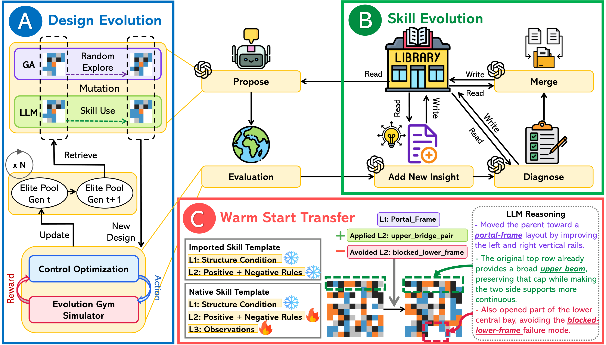
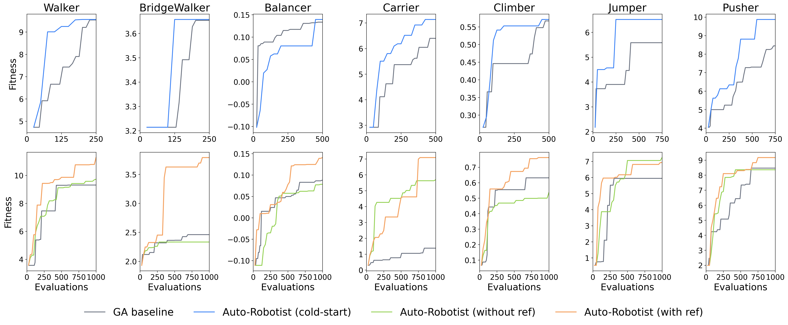
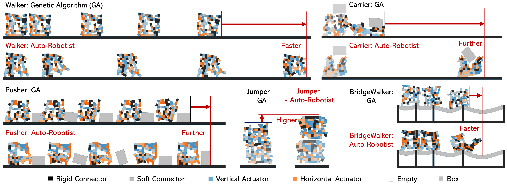

# Auto-Robotist on EvoGym

**Auto-Robotist** is a self-evolving LLM agent for soft-robot morphology design. Instead of treating each search run as a one-off optimization, the agent distills its evaluation traces into an explicit, natural-language **skill library** that can be reused across tasks and design resolutions.

This repo is built on top of [EvoGym](https://github.com/EvolutionGym/evogym) (NeurIPS 2021). The simulator, gym wrappers, and baselines are unchanged — the contribution lives in `examples/solo_leveling/`. For EvoGym installation, tutorials, and the underlying gym API, see the upstream [EvoGym README](https://github.com/EvolutionGym/evogym).

---

## Method

Auto-Robotist runs a closed loop between **using** memory and **updating** memory through four operations:

- **Propose.** Retrieve relevant skills and prompt the LLM to edit elite parents toward them, with GA mutation in parallel for exploration.
- **Add.** Add a new archetype when unassigned evidence recurs.
- **Diagnose.** Refine an existing skill's rules from new fitness gains and failures.
- **Merge.** Consolidate skills that describe the same structural principle.

Each skill is a three-level record:

- **L1 — archetype.** A high-level structural  description of the skill.
- **L2 — rules.** The actionable design knowledge.
- **L3 — observations.** The grounded evidence.

Because rules name *relations among functional parts* rather than absolute voxel coordinates, a `5×5` principle can guide a `10×10` search without any voxel upsampling — the LLM weights stay fixed; the explicit design memory is what evolves.

<p align="center">
  
</p>

---

## Results

Across seven EvoGym tasks (Walker, BridgeWalker, Balancer, Carrier, Climber, Jumper, Pusher):

- **5×5 cold-start.** Matches or exceeds GA on every task; reaches GA's endpoint up to **~2×** faster.
- **5×5 → 10×10 transfer.** Importing the learned library beats GA on **all seven** tasks. A skill-only variant (no source body shown) confirms gains come from *rules*, not visual imitation.

<p align="center">
  
</p>

<p align="center">
  
</p>

---

## Running Auto-Robotist

After installing EvoGym (see upstream README), provide an OpenAI key — via env var or by editing `examples/solo_leveling/config.py`:

```bash
export OPENAI_API_KEY=sk-...
```

```bash
cd examples

# Smoke test
python run_solo_leveling.py --exp-name smoke_test --total-gen 2 --num-cores 4

# Full run
python run_solo_leveling.py --exp-name solo_walker_001 --total-gen 50 --num-cores 12
```

---

## Acknowledgements

Built on [EvoGym](https://github.com/EvolutionGym/evogym) ([Bhatia et al., NeurIPS 2021](https://arxiv.org/pdf/2201.09863)). The Auto-Robotist agent and accompanying experiments are new in this repository.
